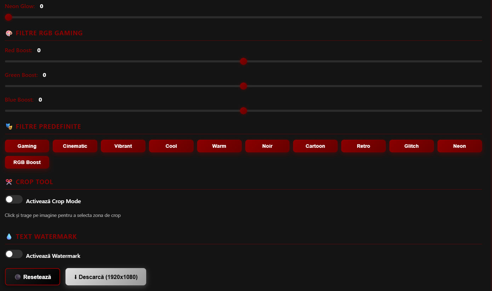

# 🎮 Gaming Setup Editor

[](https://github.com/LegionsX-Marius/Gaming-Image-Editor)
[](https://github.com/LegionsX-Marius/Gaming-Image-Editor/fork)
[](https://opensource.org/licenses/MIT)
[](https://LegionsX-Marius.github.io/Gaming-Image-Editor/)

Un editor de imagini web simplu și puternic, optimizat pentru editarea setup-urilor gaming cu RGB lighting. Interfață modernă cu temă dark (roșu, alb, negru) și funcții avansate de editare.




## ✨ Caracteristici

### 🎨 Editare Avansată
- **Rotație** - Rotește imaginea la orice unghi (-180° - 180°)
- **Luminozitate** - Ajustează luminozitatea (50% - 150%)
- **Contrast** - Control complet al contrastului (50% - 200%)
- **Saturație** - De la alb-negru la culori saturate (0% - 200%)
- **Claritate** - Sharpening pentru detalii mai clare (0-100)
- **Efect Cartoon** - Transformă imaginea în desen animat (0-100)
- **Vignette** - Efect de întunecare graduală spre margini (0-100)

### 🎭 Filtre Predefinite
- **Gaming** - Vibrant și sharp pentru setup-uri RGB
- **Cinematic** - Look de film cu vignette
- **Vibrant** - Culori intense și saturate
- **Cool** - Tonuri reci și chill
- **Warm** - Tonuri calde și prietenoase
- **Noir** - Alb-negru cu contrast dramatic
- **Cartoon** - Efect complet de desen animat

### 💾 Export
- Export direct în rezoluție **1920x1080** (Full HD)
- Format PNG de înaltă calitate
- Scalare automată și centrare

### 🎯 Funcționalități Extra
- **Drag & Drop** - Trage imaginea direct în browser
- **Paste din Clipboard** - Ctrl+V pentru a încărca rapid
- **Upload clasic** - Buton de încărcare fișier
- **Logo personalizabil** - Suport pentru logo propriu
- **Resetare automată** - Setările se resetează la original când încarci o imagine nouă

## 🌐 Demo Live

**[👉 Încearcă editorul acum!](https://LegionsX-Marius.github.io/Gaming-Image-Editor/)**

Fără instalare, fără înregistrare - doar deschide și începe să editezi!

## 🚀 Instalare și Utilizare

### 📦 Instalare pe GitHub Pages

1. **Fork sau Clone repository-ul**
```bash
git clone https://github.com/LegionsX-Marius/Gaming-Image-Editor
cd gaming-image-editor
```

2. **Structura de foldere**
```
gaming-setup-editor/
├── index.html          # Fișierul principal
├── README.md           # Acest fișier
└── img/
    └── logo.png        # Logo-ul tău personalizat (opțional)
```

3. **Activează GitHub Pages**
   - Mergi la **Settings** → **Pages**
   - La **Source**, alege `main` branch și folder `/ (root)`
   - Click pe **Save**
   - Site-ul va fi live la: `https://legionsx-marius.github.io/Gaming-Image-Editor/`

### 🎨 Personalizare Logo

Pentru a adăuga logo-ul tău:
1. Creează folderul `img` în root
2. Adaugă imaginea `logo.png` (înălțime recomandată: 60px)
3. Formatul: PNG cu fundal transparent pentru best results

Dacă nu există logo personalizat, se va afișa emoji-ul 🎮 implicit.

## 📖 Cum se folosește

1. **Încarcă o imagine:**
   - Click pe butonul "Alege Fișier"
   - SAU trage imaginea direct în browser
   - SAU copiază o imagine și apasă Ctrl+V

2. **Editează imaginea:**
   - Folosește sliderul pentru fiecare setare
   - SAU alege un filtru predefinit
   - Toate setările sunt resetate automat la 100% când încarci o imagine nouă

3. **Descarcă rezultatul:**
   - Click pe "⬇ Descarcă (1920x1080)"
   - Imaginea va fi salvată în rezoluție Full HD

## 🛠️ Tehnologii Utilizate

- **HTML5 Canvas** - Pentru procesarea imaginilor
- **Vanilla JavaScript** - Fără dependențe externe
- **CSS3** - Animații și efecte moderne
- **GitHub Pages** - Hosting gratuit

## 🎨 Temă și Design

- **Culori:** Roșu închis (#8B0000), Alb, Negru
- **Stil:** Modern, dark, gaming-oriented
- **Responsive:** Funcționează pe desktop și mobile
- **Animații:** Hover effects și transitions fluide

## 🔮 Adăugare Filtre Noi

Pentru a adăuga un filtru nou, editează fișierul `index.html`:

1. Găsește funcția `applyPreset(preset)` în JavaScript
2. Adaugă un nou obiect în `presets`:

```javascript
retro: { 
    brightness: 95, 
    contrast: 110, 
    saturation: 120, 
    sharpness: 0, 
    cartoon: 0, 
    vignette: 30 
}
```

3. Adaugă butonul în HTML:

```html
<button onclick="applyPreset('retro')">Retro</button>
```

## 📝 License

MIT License - Folosește-l liber pentru proiectele tale!

## 🤝 Contribuții

Contribuțiile sunt binevenite! 

1. Fork repository-ul
2. Creează un branch pentru feature-ul tău (`git checkout -b feature/AmazingFeature`)
3. Commit modificările (`git commit -m 'Add some AmazingFeature'`)
4. Push pe branch (`git push origin feature/AmazingFeature`)
5. Deschide un Pull Request

## 📧 Contact

Pentru bug-uri, sugestii sau întrebări, deschide un Issue pe GitHub.

---

**Made with ❤️ for gamers and content creators**


🎮 Perfect pentru streameri, YouTuberi și gaming enthusiasts! 🎮

